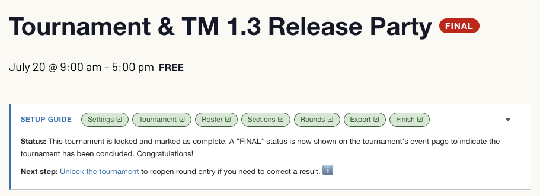
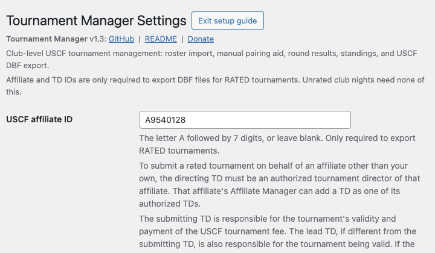
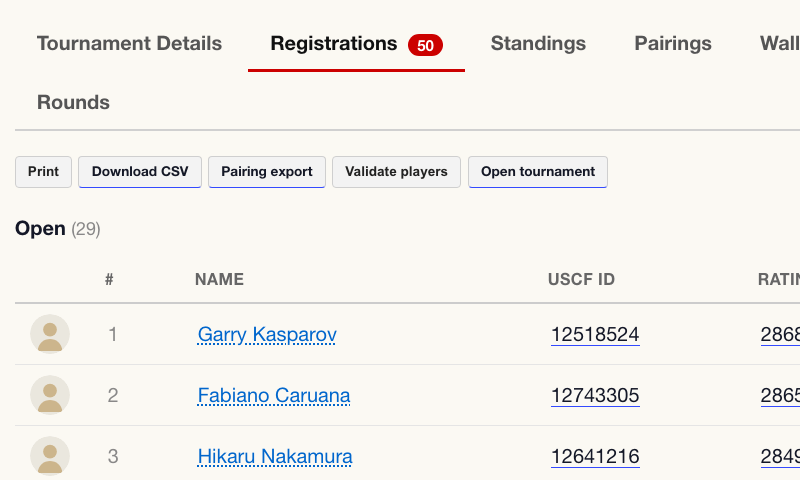
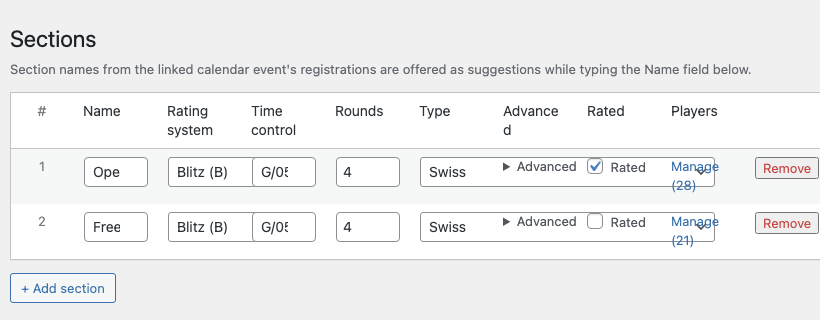
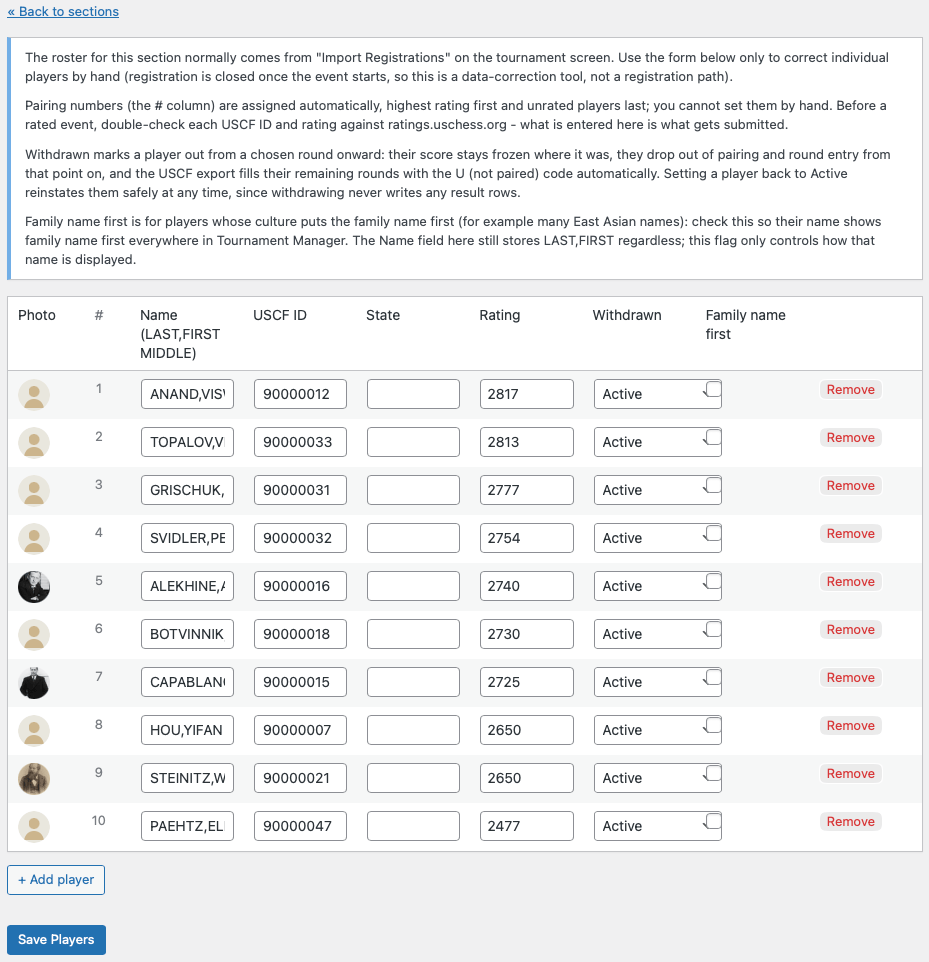
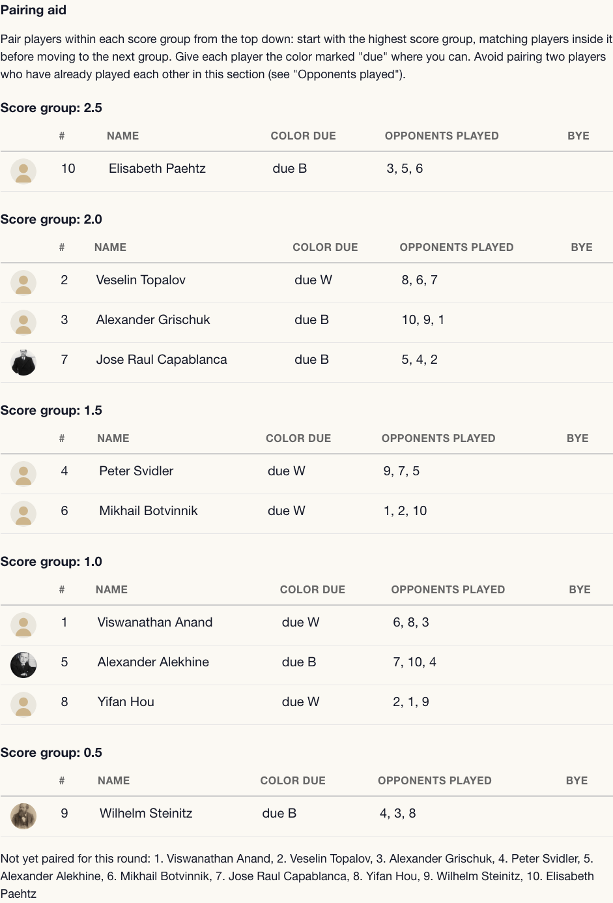
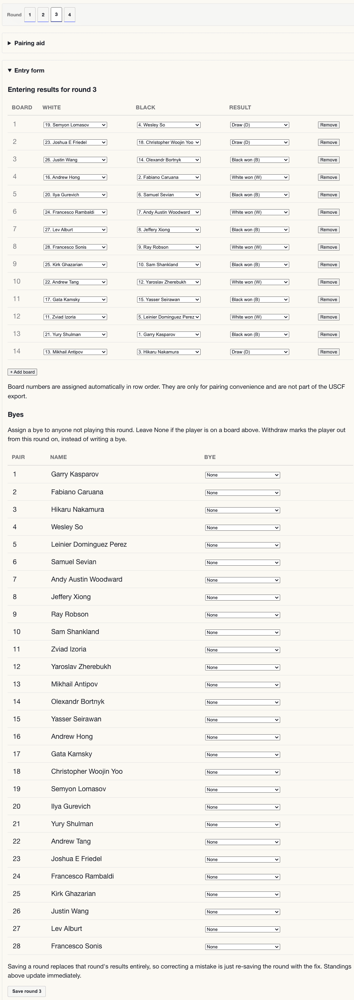
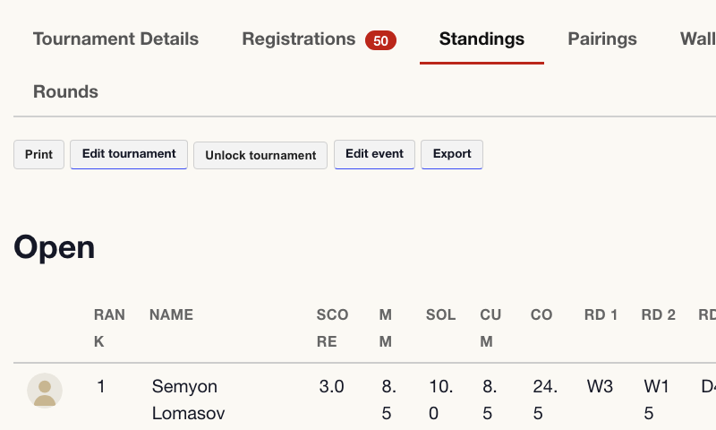
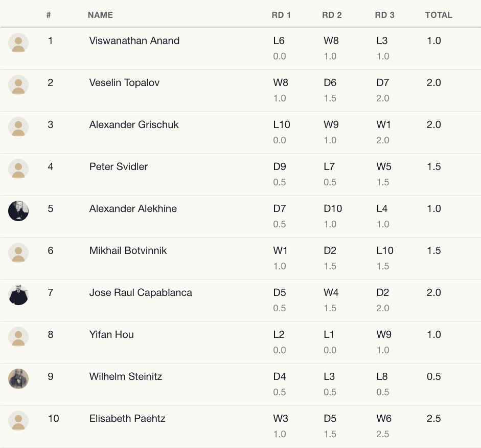
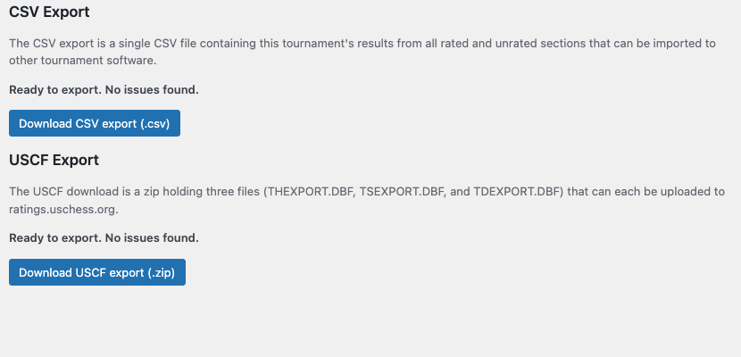

# Tournament Manager

A free, truly open-source WordPress plugin for running club-level USCF chess tournaments end to end: setup guide, roster import, pairing aid, round-by-round result entry, standings with USCF tiebreaks, USCF DBF export for upload to [ratings.uschess.org](https://ratings.uschess.org), and optional CSV export of tournament results.

No monthly fees and no desktop software needed. Run locally, on your own server, or on cheap shared hosting. You can actually run entire rated and unrated tournaments from your phone using your existing WordPress login, and multiple tournament directors can even run multiple tournaments simultaneously.

Tournament Manager was built for the [McMinnville Chess Club](https://macchess.org) as an alternative to online and desktop tournament software, and it's been generalized for clubs that want tournament management on their own WordPress site with unlimited tournaments and unlimited players.

If you find this plugin useful, consider [making a donation](https://macchess.org/donate) to the McMinnville Chess Club!

## Requirements

- WordPress 5.0 or later
- PHP 7.4 or later
- The `zip` PHP extension (php-zip), to build the USCF export download

Along with WordPress itself, Tournament Manager uses several open source plugins for events and registration, and it needs all four of these:

- [The Events Calendar](https://wordpress.org/plugins/the-events-calendar/) (TEC)
- [Event Tickets](https://wordpress.org/plugins/event-tickets/) (ET)
- [Event Tickets Extra Custom Fields](https://github.com/christefano/wp-etecf) (ETECF)
- [Event Tickets Registrations](https://github.com/christefano/wp-etr) (ETR)

Tournament Manager pulls in a club's existing online registration from ET (enhanced with extra custom fields from ETECF) and straight into a tournament manager with sections, pairings, wall charts, standings, and final results. ETECF and ETR are standalone plugins by [the same developer](https://github.com/christefano/) as Tournament Manager (TM), and TM builds on top of them.

## Features

**Registration import**

- Bring a roster in from ETR's "Pairing export" CSV, a roster uploaded manually, or (with ETR 5.2.4+) pulled straight over with one click with the "Create tournament" button on the event's Registrations tab.
- Players marked "No-show" on their player card in ETR in advance of the import are skipped and aren't included in the tournament roster.
- A USCF ID can be entered during event registration and is imported by Event Tickets Registrations (ETR).
- Tournament sections can be marked as rated or unrated, and sections can be split into 4-player round robin quads during import.
- A registrant's details entered during registration are shown to the tournament director (TD) in the roster editor.
- Registrants can request a bye during registration using an "Additional info" field created by ETECF.

**Section types**

- Swiss, Round Robin, and Quads are supported. A round robin section still submits to USCF in ordinary Swiss round-by-round format (the USCF TD / Affiliate FAQ treats the round robin grid and the Crenshaw-Berger Swiss-style report as equivalent for rating purposes, so Tournament Manager doesn't need a separate submission format for it).

**Pairing aid and round entry directly on the event page**

- Score groups, color due, and opponents already played for Swiss sections.
- A "Still to play" list is shown in place of score groups for round robin sections since those pair by a fixed schedule instead of standings.
- Byes and withdrawals: withdrawing a player freezes their score as of the round they left and drops them out of future pairing without deleting any of their play history. Withdrawals also handle disqualified players for future rounds.
- Saving a round replaces the round's results, and accidentally submitting the same form twice is harmless and doesn't duplicate results.

**Standings**

- Support for all four USCF rulebook 34E tiebreaks, in order: Modified Median, Solkoff, Cumulative, and Cumulative of Opposition. Anyone still tied after all four is genuinely tied: divide cash prizes evenly, and settle an indivisible prize with a playoff or a coin flip (rule 34C). Standings then order those players by rating and then name purely to keep the table from reshuffling between page loads, which is not a tiebreak and shouldn't be read as one.
- Unplayed games follow the USCF rulebook. For Modified Median and Solkoff, a bye, a forfeit, or a round missed after a withdrawal counts as 0.5 toward an opponent's score and as 0 toward the player's own. Plus, minus, and even scores are judged against the section's maximum possible score, so a player who withdrew or entered late still lands in the right band. Sections of nine or more rounds discard two opponent scores per side instead of one. Cumulative and Cumulative of Opposition apply their own unplayed-game deductions.
- Shown automatically on the linked calendar event page (managed by The Events Calendar, or TEC) on the Standings tab and available anywhere via the `[wpmtm_standings]` shortcode (you can add `tournament="123"`, e.g. `[wpmtm_standings tournament="123"]`, to point at a specific tournament).
- Note that the event page's Standings tab is the official live view and that a shortcode placed elsewhere can lag behind it until that page's own cache entry expires.

**Pairings**

- Tournament directors can print a pairing sheet, and a public Pairings tab on the event page provides the same information and lets players look up their own board, opponent, and color for the current round. Each section (whether printed or online) shows a board list with board number, White, Black, the result once it's in, and any byes listed.
- A round's pairings show which players are seated at a board or given a bye. A round becomes visible to everyone on the event page's Pairings tab immediately after a TD saves it.
- A tournament director can click a player's name on the Standings, Pairings, or Wall chart tab to open a player card with a link to edit their registration, an Email button, and their admin note; the public sees plain names only.

**USCF export**

- Tournament Manager provides a clean report export as a zip containing `THEXPORT.DBF`, `TSEXPORT.DBF`, and `TDEXPORT.DBF` files that are ready to upload to [ratings.uschess.org](https://ratings.uschess.org). This is a manual upload in order to keep Tournament Manager lean and mean, but submitting directly to USCF may be added in the future if I get access to the USCF MUIR API v2 currently under development.
- A readiness report runs a pre-export validator against the tournament's rated sections and helpfully explains errors and warnings. Errors block the USCF and CSV downloads, and warnings don't.
- The readiness report also re-checks the Chief and Assistant TD's USCF membership and Safe Play certification with the USCF API on download. A lapsed TD or an expired Safe Play certification for a rated tournament will result in an error that blocks the download, since USCF would reject a submission anyway. A player membership problem stays as a warning to give players time to renew their USCF membership.
- If the USCF API can't be reached to check a TD, it's a notice and doesn't block the USCF export, so an outage or spotty WiFi at a tournament venue never strands a tournament that has a valid TD.

**CSV export**

- CSV export of tournament results is supported and is in the Tournament Export section on the tournament edit page. The CSV file contains every section's results, rated and unrated alike, ready to import into other tournament software.
- The CSV's readiness report checks are the same as the USCF export but skips everything specific to a USCF submission (club affiliate ID, TD IDs, and rating system), so an all-unrated tournament with no club affiliate ID set at all can still export a clean CSV.

**USCF status validation**

- Player registrations are checked automatically during registration, when "Automatically check registrant memberships and ratings with USCF" is enabled on Tournament Manager's settings page, and the tournament has rated sections. If their USCF membership isn't active through the event's last day, they see a heads up on the order confirmation page.
- If "Automatically check registrants" is disabled, checks are skipped entirely. Nothing will be saved or blocked either way. This is also skipped silently if the USCF API is slow or unresponsive, so it doesn't affect checkout.
- The same toggle also controls the rating sync: when on, the registrant's self-entered USCF rating is replaced with the official USCF rating (Regular preferred, Quick as a fallback).
- A "Validate with USCF" button in Settings and on the tournament edit page can check the club affiliate ID plus each TD's membership, TD certification, and Safe Play certification status. Results show PASS or FAIL per person with the reason spelled out ("Expired 2025-01-31", "Not a certified TD", "No Safe Play certification on file") with a "renew soon" heads up when something passes but expires within 30 days of the tournament's last day. Other than the DBF export, nothing in Tournament Manager is ever blocked by a validation result. Saving a tournament with a lapsed TD shows a warning and export isn't blocked, which gives a TD time to renew their club affiliate ID, USCF membership, or Safe Play certification.

**Settings**

- One Settings page for the USCF club affiliate ID, default Chief TD member ID, Assistant TD member ID, default city / state / ZIP for new tournaments, time control presets, whether registrants are automatically checked (memberships and ratings) with USCF at registration, and whether tournament data is deleted or kept on uninstall (default is off, so data is kept by default).
- "Automatically check registrant memberships and ratings with USCF" is enabled by default and does two things at registration: it warns a registrant on their ticket order confirmation page if their USCF membership isn't active through the event's last day, and it pulls the official USCF rating (Regular preferred, Quick as a fallback) into the registrant's rating field. The USCF MUIR API v1 is unsupported by USCF, though, and it may stop working in the future if it's replaced by the MUIR API v2 currently in development. If it ever misbehaves, turn this off. The manual "Validate players" and "Validate with USCF" buttons also check on demand regardless of this setting, so a club that turns it off is never without a way to check.
- In each individual tournament's settings, a different club affiliate ID and Chief and Assistant TD IDs can be set, and this allows Tournament Manager to run rated tournaments for multiple clubs. There's a "Use default" button that copies the matching Settings into that field with one click. The DBF export and the TD status checks use what's set on the tournament, and a blank field is genuinely blank.

**FIDE flag**

- Sometimes a tournament is both USCF- and FIDE-rated. In this case, a section can be marked FIDE rated, which passes a flag through to the USCF export header and adds a reminder that FIDE rating is a separate submission that Tournament Manager does not handle. It's a flag only, not a FIDE-format export.

**Profile pictures**

- A per-tournament "Show profile pictures" toggle adds a player profile photo to the public standings table, the wall chart, and the TD's pairing aid.
- Photos are off by default and can be toggled on and off (useful for youth tournaments or if registrants upload inappropriate photos).
- Photos come from the registrant's event registration (ETR 5.2.4 / ETECF 5.2.3 or newer), are carried in automatically by the one-click "Create tournament" button on an event's Registrations tab, and are saved in the WordPress media library for reuse across multiple registrations, tournament recap blog posts, and so on.
- Players imported from a CSV or with no photo on file get a boring profile picture instead.
- A new tournament created from an event defaults the "Show profile pictures" toggle to match that event's own "Show photos" setting in the event's meta box.

**WP-CLI**

- `wp wpmtm validate players|tds|affiliate|all`, each accepting `--tournament=<id>` (or `--event=<id>` for players/affiliate) and `--format=json`, run the same USCF checks the admin screens use from the command line. This is handy for a cron job, a pre-submission sanity check, or if a roster is particularly large. Any check that fails exits with a non-zero exit code. If the USCF is unreachable TM will report that, but this doesn't by itself fail the command.

**Performance**

- Assuming Tournament Manager is running on a publicly-accessible website, everything the general public sees (a saved round, a withdrawal, a settings change) flushes that event page across whichever page caching plugin is active (W3 Total Cache, WP Super Cache, WP Rocket, and LiteSpeed Cache).
- TD-only pages are never cached. The public always sees a cached page, so long as a supported caching plugin is active.
- Using ETR's "Demo mode", Tournament Manager has been performance tested up to 200 players with 5 rounds. In a test with 100 players and 5 rounds, database queries were under 10ms (40ms for the USCF export), memory around 2MB, and page size was just 81KB. Demo mode draws from a pool of 50 real, currently-active US Chess members managed by Tournament Manager (see "Test player pool" below), so those test registrants pass the same USCF checks a real roster does.
- Note that putting hundreds of players in the same section will have a performance cost for TDs. Tournaments don't really ever have mega sections, though, so this would never happen in reality.
- The All Tournaments page is the only truly heavy page because it checks the status of every tournament (3 database queries per unlocked tournament) and suggests next steps for the TD. For this reason, it's important to **lock tournaments when they're over** so the All Tournaments page doesn't unnecessarily check their status.

**USCF API calls and caching**

The USCF MUIR API v1 behind all of the membership and TD checks is officially unsupported by USCF, so Tournament Manager deliberately keeps its calls to the API to as few as it can. Here's exactly when a lookup happens and what gets cached:

- An attendee's fields saving (at checkout or on edit) triggers one lookup per registrant, cached for a day. This is sync, best-effort, and never blocks or slows checkout if the API is slow or unreachable.
- The tournament edit page makes no API calls at all. It shows the last known result and says so when a player or TD hasn't been checked yet.
- The "Validate players" and "Validate with USCF" buttons check with the API because a cached, day-old answer wouldn't tell a TD who just fixed something at USCF anything useful. These validation buttons call the API on demand and are unaffected by the automatic-checking Settings toggle.
- The USCF export download always checks the TDs and the players with the API in order to block a bad submission.
- Saving a tournament runs one cached check of the TD IDs.
- WP-CLI's validate commands are cached by default, so a cron job can't hammer the API on its own. Force a live check with the `--fresh` flag.
- Cache lifetime is one day, and a 404 (usually from a bad or mistyped ID) is cached, too, so a typo doesn't re-hit the API on every click.

**Test player pool**

- Tournament Manager provides a pool of 50 real, currently-active USCF members with their real member IDs and current Regular ratings. These are the highest-rated tournament players, at least according to the USCF ratings API, and every ID and rating was verified individually against the API as of June, 2026.
- The test player pool is in TM and not ETR because it's for tournament testing, not registration testing. ETR's "Demo mode" reads it from TM when generating test registrants, and if TM isn't active, Demo mode will say so.
- Real IDs are the whole point: test registrants generated from this pool make it possible to test the same player management, round entry, USCF membership and rating verification, and export validation that a real roster does.

**Permissions**

- All tournament admin pages require the `wpmtm_manage_tournaments` permission, and administrators are granted it automatically on activation.
- The `wpmtm_manage_tournaments` permission enables simultaneous management of multiple tournaments by multiple TDs without ever showing a TD the tournaments belonging to another TD.
- The Settings page requires the `manage_options` permission.

## Screenshots

A quick tour of a tournament with test data from setup to USCF upload. Click any image for the full-size version.

 _Setup guide - progressively walks through Settings, Tournament, Roster, Sections, Rounds, Export, and Finish, always naming the exact control to click next._

 _Settings - USCF affiliate ID, default chief and assistant TD member IDs, default city / state / ZIP, time control presets, the delete-on-uninstall switch, and the optional "Tournament Manager" role for a volunteer TD._

 _Registrations tab - the event's roster with USCF ID and rating per player, plus Download CSV, Pairing export, Validate players, and the one-click "Open tournament" / "Create tournament" import into Tournament Manager._

 _Sections editor - each section carries its own rating system (Swiss, Round Robin, or Quad), time control, round count, and rated flag, so one event can mix rated and unrated sections._

 _Sections editor's Manage registrants - Preview and optionally edit the roster, change Withdrawn status, and show Family name first everywhere a name is displayed._

 _Pairing aid - score groups with the color due and the opponents already played, so a TD can pair each round by hand from the top down (or let the "Suggest pairings" button do it)._

 _Round entry - a round selector shows every round at a glance with the one you're viewing clearly marked, above a collapsible Pairing aid and Entry form (set each board's result, assign a bye, or withdraw a player) that open to whichever one you need next._

 _Standings - Standings with all four USCF 34E tiebreaks in order (Modified Median, Solkoff, Cumulative, Cumulative of Opposition), shown live on the event page._

 _Wall chart - each player's opponent and result with a running score, round by round._

 _CSV and USCF export - The CSV export contains the results for all sections (rated and unrated) and can be imported into other tournament management software. The USCF export runs a readiness report and validates the rated sections, then downloads the three DBF files (THEXPORT, TSEXPORT, and TDEXPORT) that can each be uploaded to ratings.uschess.org._

## Installation

1. Get Tournament Manager from the [releases](https://github.com/christefano/wp-tournament-manager/releases) page, and upload the plugin to `wp-content/plugins/wp-tournament-manager` (or install the zip through Plugins -> Add New -> Upload Plugin).
2. Activate it. Activation creates the plugin's database tables and grants the `wpmtm_manage_tournaments` permission to administrators.
3. If you plan to run rated events, visit Tournament Manager -> Settings and enter your club's USCF affiliate ID and TD member IDs before your first export.

## Usage

First, an event for the tournament needs to exist (using The Events Calendar, or TEC), and tickets and registrations need to be enabled for it (using Event Tickets, further enhanced by ETECF). Then a typical TD's first tournament, start to finish, goes like this:

1. **Settings**
- Tournament Manager -> Settings: set the affiliate ID and TD IDs (rated events only), default city / state / ZIP, and time control presets so you don't retype them per section.
2. **Create a tournament**
- Add a tournament, link it to the event's page, and set rated / unrated and confirm its date range. This is what turns on the pairing aid, wall charts, results, and standings on the event page itself.
3. **Import the roster**
- Click "Create tournament" right on the event's Registrations tab, or upload ETR's "Pairing export" CSV in the tournament's edit page. Review the preview (sections, rated flags, no-shows skipped, any blank USCF IDs) and confirm.
- A "Family name first" option is available to reverse the display of First and Last names for individual registrants.
4. **Enter rounds**
- On the event's page, use the pairing aid under the Rounds tab to pair each round either by hand or with the "Suggest pairings" button, then enter results (or byes or a withdrawal) and save. Standings are updated immediately for anyone viewing the page. The "Suggest pairings" button pairs all the players and populates the pairing aid for you to review, modify, and save. Pairings are determined by closeness in rating; a player is never paired against the same opponent twice, and family members (players sharing a family key or a last name) are not paired against each other when an alternative exists.
5. **Check standings**
- The event page shows live standings with tiebreaks under the Standings tab.
6. **Export**
- For rated tournaments, the tournament's edit page runs a readiness report. Review errors and warnings (e.g. a registrant's USCF ID is missing due to them registering before getting one). Errors block the download and warnings don't.
- Once it's error-free, download the DBF zip and upload its contents at [ratings.uschess.org](https://ratings.uschess.org).
- For unrated tournaments, a USCF export wouldn't make sense, and there's a CSV export for historical purposes or to import into other tournament software.

## Setup guide steps

The setup guide panel on the tournament edit page (and on the event page for a TD) walks through the steps below. The setup guide's "Next step" is the short version, and more detail is in this README help section.

### Create step

Every other step needs a tournament to attach to. Create one with "Add New" under Tournament Manager, or use the "Create tournament" button on the event's Registrations tab to build one automatically from the registrations. Link the tournament to its calendar event so the pairing aid, standings, and wall chart appear on the event page.

### Settings step

Under Tournament Manager -> Settings, set at least the club's default USCF affiliate ID and Chief TD ID. Every tournament's own affiliate / TD fields can then copy these in with a "Use default" button instead of retyping them. The city / state / ZIP defaults and time-control presets are optional conveniences set here, too.

### Tournament step

On the tournament's edit page, enter its name, the linked calendar event, and location. If this is a USCF-rated tournament, also set the Chief TD ID and make sure the affiliate ID is in place (the "Use default" buttons copy in the Settings values). USCF reads these off the top of a submission, and a rated tournament cannot be exported without them.

### Roster step

Import the players from the linked calendar event: use "Create tournament" on the event's Registrations tab, or open the tournament's edit page and upload the event's "Pairing export" CSV under Import Registrations. Review the preview (sections, rated flags, no-shows skipped, blank USCF IDs) and confirm. Round entry and standings both need a roster to work with.

### Sections step

On the tournament edit page, set each section's number of rounds in the sections editor. Most tournaments run at least 3 rounds. A section imported from the event's own ETECF "Section" field already has a suggested name, so this is usually just confirming the round count. A section with no round count set is treated as unconfigured and keeps the guide on this step.

### Rounds step

On the event page's Rounds tab, pair each round with the pairing aid (either manually or with the "Suggest pairings" button), then enter results, byes, or a withdrawal and save. Standings update immediately for anyone viewing the page. Standings rank by score until every round is entered, after which tiebreaks settle final rankings.

### Export step

For a rated tournament, check the standings and wall chart first: a mistake is cheap to fix now and expensive once USCF has rated the event. Look for a result on the wrong board, a player who withdrew but still shows a bye, or a name or USCF ID that came in wrong during registration. Then download the USCF export (for rated tournaments) or the CSV export (for unrated tournaments) on the edit page, clear any validator errors, and download. For rated tournaments, upload the contents of the USCF export zip at [ratings.uschess.org](https://ratings.uschess.org). A lapsed Chief TD or expired Safe Play certification blocks the download, and a player membership problem is only a warning and still lets you export.

### Finish step

Finishing is technically optional but it's highly recommended. When the tournament is over, use "Lock the tournament" to close round entry and mark it as complete. This is the TM counterpart to packing up the boards.

A locked tournament puts a "final" badge on the event page and marks it as complete on the All Tournaments page (and actually makes the All Tournaments page load faster).

Unlock the tournament again if you ever need to correct a result. Sharing results in a blog post is optional, too, but this is common practice. The standings and wall chart are already public on the event page, and the Print button on either gives a clean copy for the club noticeboard.

## Troubleshooting

**How do I update Tournament Manager?**

Tournament Manager uses [Plugin Update Checker](https://github.com/YahnisElsts/plugin-update-checker). A new version shows up under Dashboard -> Updates and on the Plugins page with the usual "update now" link, and your tournaments, sections, players, and results are untouched by an update.

Nothing extra to install. The update check ships inside the plugin.

Checks run a couple of times a day, so a release can take a few hours to appear. Clicking "Check again" on the Updates screen asks immediately. Only published releases are offered, so day-to-day work in the repository never prompts you to update, and you'll never be asked to update in the middle of a tournament because someone pushed code that morning.

If you'd rather a site never check, add `define( 'WPMTM_DISABLE_UPDATE_CHECK', true );` to its `wp-config.php`. This is worth doing on a development or staging copy, which would otherwise offer to overwrite your working files with a release.

**What's the difference between an event and a tournament?**

An "event" and a "tournament" are two different things, managed by two different plugins. The *event* is the public listing that players see and register for using The Events Calendar (TEC), with registration handled by Event Tickets (ET), further enhanced by Event Tickets Extra Custom Fields (ETECF), and Event Tickets Registrations (ETR).

The *tournament* is created by Tournament Manager (TM) and has all the pairing, round entry, standings, and CSV / USCF export data. A *tournament* links to a TEC calendar event: TEC/ET/ETECF/ETR does all the event page and registration, and TM handles everything for actually running the tournament once registration closes.

**What about walk-ins and late entries?**

Tournament Manager doesn't create registrations, Event Tickets does. To add someone after online registration has closed, register them yourself through the event's front-end registration form with you as the ticket purchaser. Set up a 100% off coupon in Event Tickets for zero-cost entries (handy for a cash-at-the-door player, or someone who registered by email or over the phone), and they show up on the event's Registrations tab like anyone else and are ready to import.

Once they're registered you can see them on the event's Registrations tab and edit their details through their registration form link. That link isn't in Tournament Manager: go to "Registration Link Lookup" under Event Tickets Extra Custom Fields -> Tools, and enter the order ID (or an attendee ID, which resolves to the order for you), and it hands you the link.

Note that whether the front-end registration path is open at all on the day is decided by your event registration end date ("ticket sell date"), which is controlled by Event Tickets **and** ETR's global checkbox for allowing registrations *after* an event has started.

The "+ Add player" button in a section's roster editor is a different thing: it's for data corrections, not registrations. A player added that way has no Event Tickets registration behind them, so the automatic USCF membership check at registration never runs for them. They still get checked by the USCF export and by `wp wpmtm validate players`.

**When should I delete a player instead of marking them Withdrawn?**

Withdrawn is for an ordinary no-show or if a player voluntarily leaves during a tournament.

"Remove" in a section's roster editor is a **hard delete** and not a status change. Use "Remove" only for cleanup, e.g.:

- A duplicate roster row (a re-import, or a manually re-typed row) created a second entry for the same person.
- A player imported into the wrong section (e.g. Open instead of Reserve or vice versa).
- A no-show discovered *after* import. ETR's "No-show" flag only skips a player if it's set *before* you import; if you find out after the roster's already in Tournament Manager, deleting is the only way to pull them back out.
- A registration cancelled or refunded after import. Tournament Manager doesn't watch for that, so the roster needs a manual correction.
- A mismerged or badly mistyped record where starting over is simpler than editing five fields.
- A mistaken manual "+ Add player" row.

**What happens if a player being deleted has already played rounds?**

Danger! Deleting a player deletes their opponents' recorded games for those rounds, too, not just the deleted player's own data. A board result is one shared row, and removing either side of it removes the whole row.

- Every opponent they've already played now has a *missing* result for that round. Re-exporting or re-checking readiness will flag it, and a rated export can be blocked until the TD enters a new result, a bye, or a withdrawal for that opponent.
- Standings and tiebreaks (Modified Median, Solkoff, Cumulative, Cumulative of Opposition) recompute immediately without that round for every opponent affected, and their numbers can change.
- The deleted player disappears from pairings, the wall chart, and standings entirely. Their Event Tickets / ETECF registration is untouched, though, and could reappear on a future re-import.

Tournament Manager shows a confirmation warning before deleting an already-saved player for exactly this reason. **There's no undo** once you save.

**Withdrawn vs. disqualification (DQ)**

Tournament Manager can handle the rare situation of a player who needs to be disqualified even though there's no specific disqualification feature.

First, **determine what happened**. Is the disqualified player simply out of the tournament going forward (dress code violation, unsportsmanlike behavior, being late to games, etc.) and therefore excluded from future rounds, or is there proof that cheating occurred during an earlier round? These two scenarios need to be handled differently.

1. In either DQ scenario, open Round entry for the round when the DQ takes effect, set that player to **"Withdraw (out from this round on)"**, and save. That's it for most scenarios. Tournament Manager auto-fills `U` (non-participant) for every later round in both standings and USCF export.
2. **Record the reason** for the DQ as an admin note (if an `admin_note` field has been created using Event Tickets Extra Custom Fields, or ETECF). Click "Edit registration details" on the disqualified player's player card to view, add, or edit the admin note. Any TD can view admin notes, and to add or edit them a WordPress administrator is required. This is managed by Event Tickets Extra Custom Fields (ETECF) outside of Tournament Manager

**Don't delete a board** to remove the disqualified player (this also deletes the disqualified player's opponent's results), and **don't backdate** with "withdraw after round" earlier than rounds they actually played (this breaks that round's dropdown display, though the underlying data stays intact).

If there's proof that a player cheated during a past game:

1. **Report the cheating separately and in writing to the US Chess office** as an Ethics Committee complaint. This runs independent of Tournament Manager entirely.
2. Go to the event's Rounds tab, use the round selector to open the affected round (keeping in mind that "Lock the tournament" blocks edits, so you may need to unlock the tournament first).
3. Find the board, and change the Result dropdown to change the result to the color that should have won: pick **`W`** if the disqualified player's opponent was White, or pick **`B`** if the disqualified player's opponent was Black. This automatically gives the disqualified player a reciprocal loss.
4. **Don't pick `FW` / `FB`** (forfeit). Per the USCF rulebook, a game where both sides actually made at least one move stays rated even when the loss is for a rules violation. Forfeit codes mark the game unrated, and `W` / `B` keeps it a normal, rated result.
5. Save, and standings recompute immediately off the new result via the existing scoring engine.
6. Repeat per affected round/board only. This is a targeted, one-board-at-a-time edit, not a bulk operation.

**Editing registration data before or after a tournament already has a roster**

Registration data is viewable / editable by the person who paid during registration (perfect for parents), and this is managed by Event Tickets Extra Custom Fields (ETECF) outside of Tournament Manager. Note that once registrations have been imported into Tournament Manager (via CSV or the "Create tournament" button), any later edits a registrant makes to their registration data through ETECF *are* saved, but they are reflected in ETR only and not in Tournament Manager's already-imported roster.

**The "Create tournament" button is missing**

The "Create tournament" button on ETR's Registrations tab needs ETR 5.2.4 or later. Older ETR versions will still work with Tournament Manager but only through the manual CSV upload.

**The USCF export worked, but importing to USCF doesn't**

Check that all players in rated sections have active USCF memberships and that your **club's affiliate ID**, your **TD's USCF membership**, and your **TD's Safe Play certifications** are active and up to date. If any of these are incorrect or expired, the USCF import won't work. According to USCF guidelines, a USCF membership must be active *up to and including* the date of the last day of your tournament.

This can be a show-stopper, so Tournament Manager handles a lot of this checking without being asked, and it's controlled by one Settings toggle, "Automatically check registrant memberships and ratings with USCF" (on by default). When it's on, player memberships are checked automatically the moment someone registers, but only once a rated tournament is linked to the calendar event (a heads up appears on their order confirmation page if a membership isn't active through the event's last day, and nothing is saved or blocked in the process).

An event with no linked tournament yet, or one linked to an unrated tournament, skips this automatic check entirely since casual unrated nights, and a club night before its tournament even exists, need no USCF setup. Turning the toggle off skips it everywhere, too, regardless of tournament state. Player memberships can still be checked again on demand with the "Validate players" button on the event's Registrations tab (with ETR 5.2.5+), which is unaffected by the toggle. "Validate with USCF" buttons in Tournament Manager Settings and on the tournament edit page check the club affiliate ID, TD USCF memberships, TD certifications, and Safe Play certifications on demand, which are also unaffected by the toggle.

All warnings are just a heads up, so a no-go verdict can be handled your usual way (renew, or mark the player as a no-show) except at USCF export time when a lapsed TD or an expired Safe Play certification is now a hard error that blocks the DBF download since USCF would reject that submission anyway. A player membership problem at export time stays a warning, same as everywhere else.

One caveat: the USCF MUIR API v1 that Tournament Manager's checks use is unsupported by USCF, and v2 is currently in development. What a fun time for tournament software developers!

**I don't know what is happening, what just happened, or what to do next**

There's a setup guide that walks you through setting up and managing a tournament. Click the "Show setup guide" button.

Tournament Manager explains other things as you go in admin notices, and you might not see them if you have notices hidden with a third-party plugin like [Admin & Site Enhancements](https://wordpress.org/plugins/admin-site-enhancements/) (ASE).

On the upside, you can enable a third-party plugin like ASE to hide notices if you no longer wish to see them. I recommend something like [Unnotifier](https://wordpress.org/plugins/unnotifier/) to dismiss individual notices rather than the all or nothing method that ASE and others use.

## Data

Tournament Manager creates five tables (prefixed with your WordPress table prefix): `wpmtm_tournaments`, `wpmtm_sections`, `wpmtm_players`,
`wpmtm_games`, and `wpmtm_byes`. It also saves the `wpmtm_options` option (affiliate ID, TD IDs, defaults, time control presets, and delete-on-uninstall flag) and the `wpmtm_db_version` option used to run schema upgrades.

The first `m` in `wpmtm` is a nod to the McMinnville Chess Club for which Tournament Manager was originally created.

## Uninstall

Uninstalling always removes the `wpmtm_options`, `wpmtm_db_version`, and `wpmtm_role_decision` options; every per-tournament `wpmtm_td_check_{id}` and `wpmtm_exported_{id}` option; the `_wpmtm_rating_source` and `_wpmtm_rating_checked` attendee postmeta TM wrote on ETECF's attendee posts; TM's cached USCF, registration-warning, and notice transients; the `wpmtm_manage_tournaments` permission from every role; and the optional `wpmtm_tournament_manager` role if it was ever created. It drops the five `wpmtm_*` tables only if "On uninstall" in Settings is set to delete tournament data. That setting is off by default, so a club's tournament history survives an accidental deactivate and delete.

## Acknowledgements

Tournament Manager and many of its features wouldn't exist without support from the [McMinnville Chess Club](https://macchess.org) and its members, and Mike Terrill, one of the club's founding members and tournament directors, in particular. Also Mike Nolan for giving me access to the USCF MUIR API v1, John Burroughs for making helpful suggestions and asking sharp questions, and Troy Chambers for his ongoing support and endless enthusiasm. I'm also grateful to my students at [Chess Zendō](https://chesszendo.com) who let me see chess through their eyes and keep me in touch with my love of the game. You are the future of chess.

## Changelog

See [CHANGELOG.md](CHANGELOG.md).

## License

GPL v2 or later. See https://www.gnu.org/licenses/gpl-2.0.html
